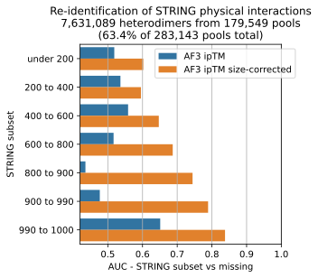

# Yeast protein-protein interactions
*We recently used pooled co-folding to map protein-protein interactions in Mgen, a small bacterium ([Todor et al, 2026](https://doi.org/10.1038/s44320-026-00189-7)).
Here we present a work-in-progress scaleup of pooled co-folding in yeast. 
We discuss technical optimisations to run pooled co-folding at scale,
and an initial comparison to experimental evidence.
Our work-in-progress predictions are publicly available.*

## Results
### Pooled co-folding recapitulates known interactions
<p align="center">

</p>

To ask whether we are recapitulating known interactors, we compared the subset of finished predictions (179,549 of 283,143 pools) to evidence of physical interaction from STRING. We binned the STRING physical interaction score to create groups of physical interactors with increasing levels of confidence. We then tested the ability of our pooled AlphaFold3 predictions to differentiate between interactions assigned to a STRING confidence bin, and interactions without any evidence in STRING.

Size-corrected AlphaFold3 confidence scores are better at re-capitulating higher-confidence STRING interactions (Figure). The AUC ranges from 0.6 for the lowest-confidence to 0.84 for the highest-confidence bins.

### A resource of predicted protein-protein interactions in yeast
To browse finished predictions, we created a self-contained web app available from [Docker Hub](https://hub.docker.com/r/jurgjn/pooled-ppi-yeast):
```
docker run -p 8501:8501 jurgjn/pooled-ppi-yeast:v26.1
```
The web app works offline, and contains top-scoring predicted structures for approximately four million heterodimers,
a quarter of all possible pairwise protein-protein interactions in yeast.

**These predicted AlphaFold3 models of protein complexes are shared as a community resource to accelerate structural biology research.
We encourage the use of this data for targeted studies, provided appropriate credit is given.
We kindly ask that researchers refrain from publishing proteome-wide or large-scale data mining studies until our formal publication is released.
However, we welcome inquiries regarding collaborative efforts and are open to joint analysis projects that leverage this resource for broader biological insights.**

**All structures generated with AlphaFold3, subject to [Output Terms of Use](https://github.com/google-deepmind/alphafold3/blob/main/OUTPUT_TERMS_OF_USE.md).**

## Methods
See [SUPPLEMENTARY.md](SUPPLEMENTARY.md) for technical details.
